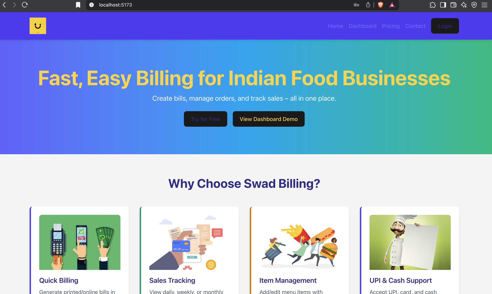
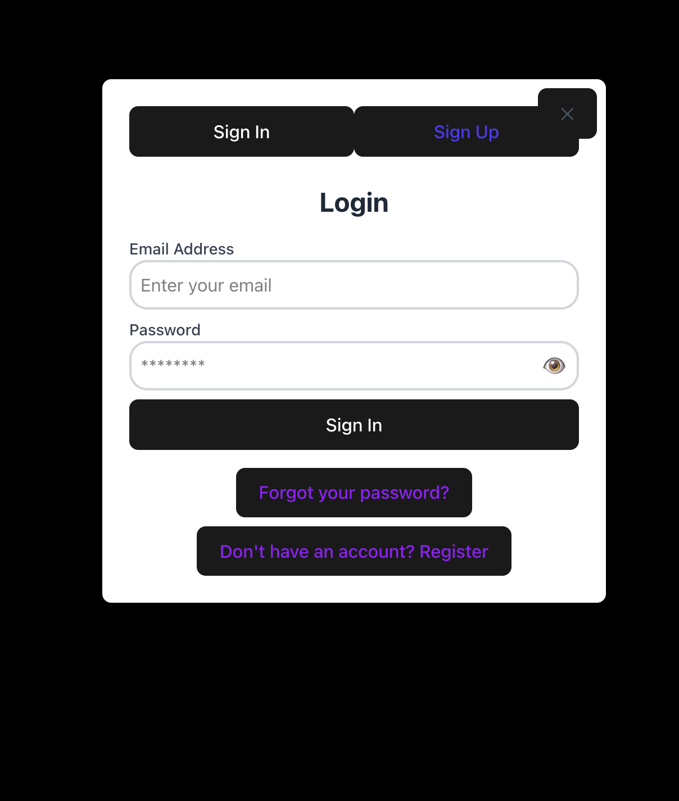
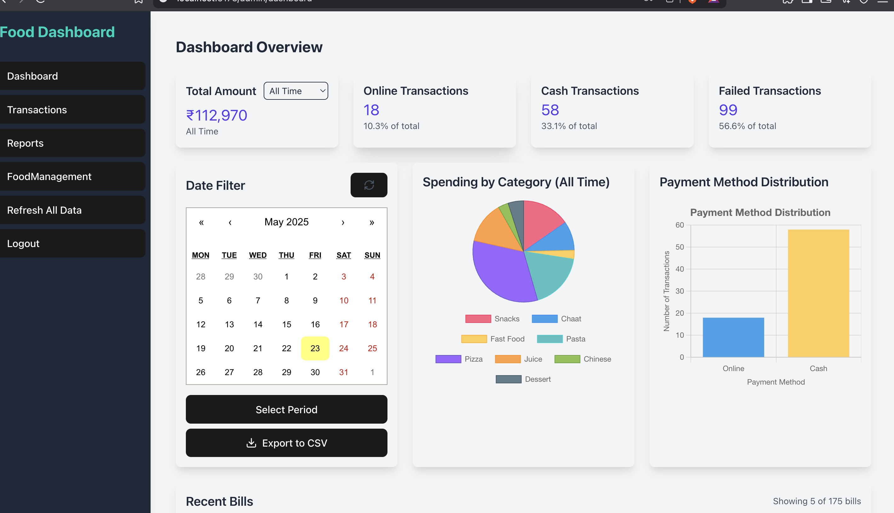
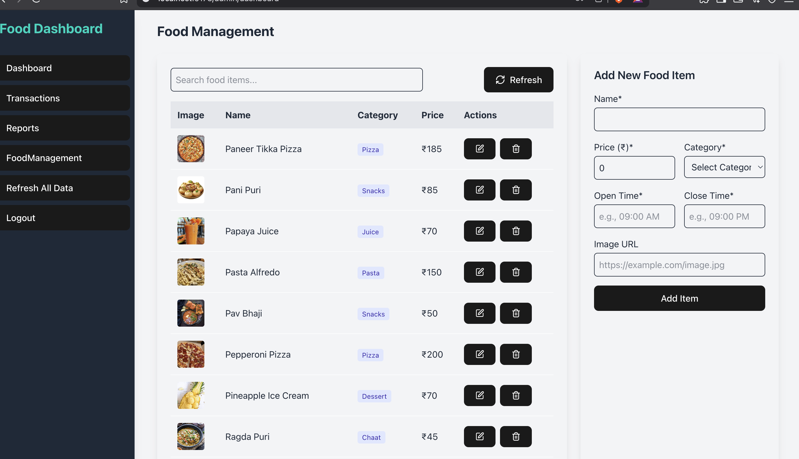
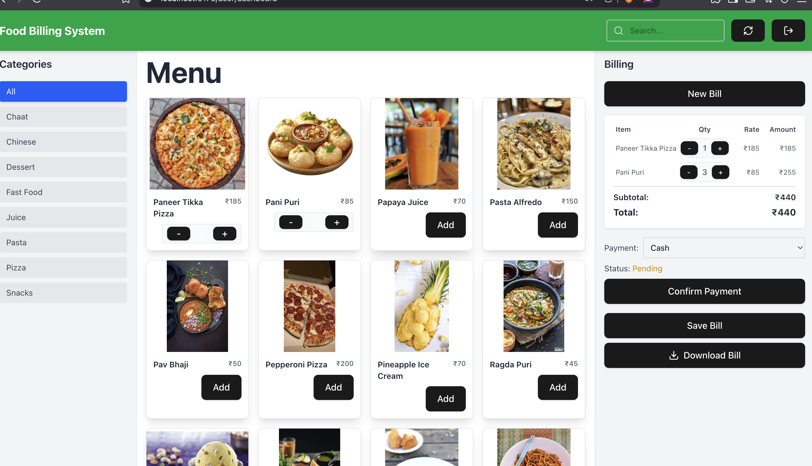
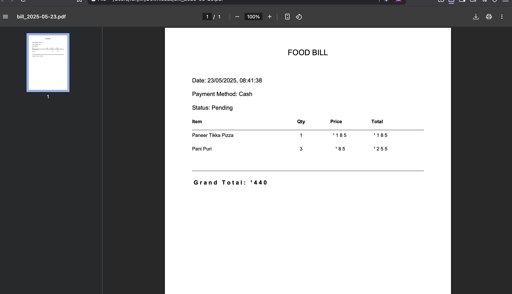
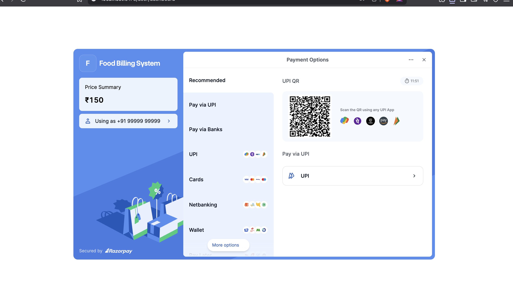

## Screenshots

### Screenshot 1


### Screenshot 2


### Screenshot 3


### Screenshot 4


### Screenshot 5


### Screenshot 6


### Screenshot 7


### Screenshot 8


## 📺 Demo Video


[Click to watch the demo video](./8mb.video-WE2-JYha0Ff6.mp4)


# 🍽️ Food Bill System – How to Run

A full-stack web application to manage food bills with:

- 🔐 Login / Registration
- 🔁 Forgot Password via OTP (Email)
- 📊 User/Admin Dashboards
- 💳 Razorpay Payment Integration (Test Mode)

---

## 📦 Prerequisites (macOS & Windows)

- [Node.js](https://nodejs.org/) installed
- MongoDB installed and running
  - **macOS**: via Homebrew
  - **Windows**: via official installer
- MongoDB Compass (optional GUI)
- Gmail (App Password required)
- Razorpay test credentials

---

## ⚙️ Setup Instructions

### 1. 🔌 Start MongoDB

#### macOS

```bash
brew tap mongodb/brew
brew install mongodb-community
brew services start mongodb-community


2. 🛠️ Backend Setup
bash
Copy
Edit
cd backend
npm install

3. env in  backend
PORT=5001
JWT_SECRET=ranjith_324232
MONGO_URI=mongodb://127.0.0.1:27017/Chat_center
EMAIL_USER=your_email@gmail.com
EMAIL_PASS=your_app_password
RAZORPAY_KEY_ID=your_razorpay_key_id
RAZORPAY_KEY_SECRET=your_razorpay_key_secret

4 cd backend

npm run run

cd frontend
npm install
npm run dev

# Start MongoDB (macOS)
brew services start mongodb-community

# Backend
cd backend
npm install
npm run run

# Frontend
cd frontend
npm install
npm run dev
'''
